# Easing Methods

An EasyEase Object comes with a set of methods that reproduce the most common interpolation curves:

- [Exponential easing](#Exponential-easing)
- [Sinusoidal easing](#Sinusoidal-Easing)
- [Circular easing](#Circular-easing)
- [Elastic easing](#Elastic-Easing)
- [easing Bounce](#Bounce-Easing)
- [easing Back](#Back-Easing)

####  [Overview Table](./overviewTable.md) -->

## Exponential Easing

Exponential easing accelerates or decelerates motion based on the value of the exponential factor.
the higher the factor, the steeper the curve

### [.in()](./methods/inExpo.md)

It starts slowly and progressively speeds up,

### [.out()](./methods/outExpo.md)

It starts fast and progressively slows down,

### [.inOut()](./methods/inOutExpo.md)

It starts slow, accelerates until reaching full-speed at the midpoint, then and progressively slows down.

<table>
  <thead>
    <tr>
      <!-- <th>curve type</th> -->
      <th>ease - in</th>
      <th>ease - out</th>
      <th>ease-in-out</th>
    </tr>
  </thead>
  <tbody>
    <tr>
      <td colspan="3">Exponential</td>
    </tr>
    <tr>
      <td>

</td>
      <td>
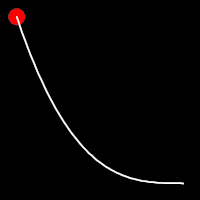

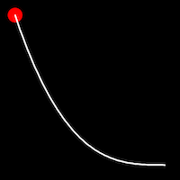
</td>
      <td>

</td>
    </tr>
  </tbody>
</table>

 
 
 
 
 

## Back Easing

Back easing incorporates a brief overshoot before settling into the target position. This method is characterized by a slight backward motion before moving forward, creating an effect similar to pulling back and releasing a spring.

### [.inBack()](./methods/inBack.md)

It starts slowly and progressively speeds up,

### [.outBack()](./methods/outBack.md)

It starts slowly and progressively speeds up,

### [.inOutBack()](./methods/inOutBack.md)

It starts slow, accelerates until reaching full-speed at the midpoint, then and progressively slows down.

<table>
  <thead>
    <tr>
      <th>.inBack()  </th>
      <th>.outBack()</th>
      <th>.inOutBack()</th>
    </tr>
  </thead>
  <tbody>
    <tr>
      <td colspan="3">Back Easing</td>
    </tr>
    <tr>
      <td>

</td>
      <td>
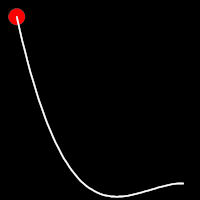

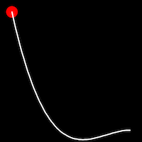
</td>
      <td>

</td>
    </tr>
  </tbody>
</table>

 
 
 
 
 

## Circular Easing

Circular easing follows a circular motion pattern. This method is characterized by its rounded curves

### [.inCirc()](./methods/inCirc.md)

It starts slowly and progressively speeds up,

### [.outCirc()](./methods/outCirc.md)

It starts slowly and progressively speeds up,

### [.inOutCirc()](./methods/inOutCirc.md)

It starts slow, accelerates until reaching full-speed at the midpoint, then and progressively slows down.

<table>
  <thead>
    <tr>
      <th>.inCirc()</th>
      <th>.outCirc()</th>
      <th>.inOutCirc()</th>
    </tr>
  </thead>
  <tbody>
    <tr>
      <td colspan="3">Circular Easing</td>
    </tr>
    <tr>
      <td>

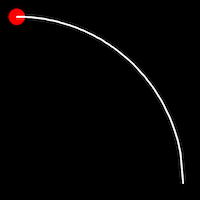
</td>
      <td>

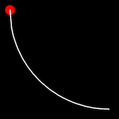
</td>
      <td>

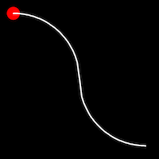
</td>
    </tr>
  </tbody>
</table>

 
 
 
 
 

## Sinusoidal Easing

Sinusoidal easing applies a sinusoidal function to the motion, resulting in a smooth, wave-like transition, providing a gentle acceleration and deceleration.

### [.inSine()](./methods/inSine.md)

It starts slowly and progressively speeds up,

### [.outSine()](./methods/outSine.md)

It starts slowly and progressively speeds up,

### [.inOutSine()](./methods/inOutSine.md)

It starts slow, accelerates until reaching full-speed at the midpoint, then and progressively slows down.

<table>
  <thead>
    <tr>
      <th>.inSine()</th>
      <th>.outSine()</th>
      <th>.inOutSine()</th>
    </tr>
  </thead>
  <tbody>
  <tr>
      <td colspan="3">Sinusoidal Easing</td>
    </tr>
    <tr>
      <td>
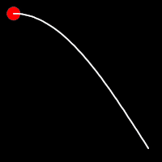

</td>
      <td>
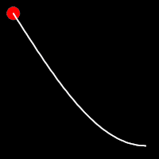

</td>
      <td>

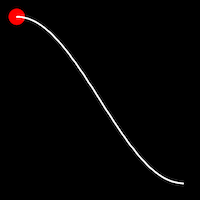
</td>
    </tr>
  </tbody>
</table>

 
 
 
 
 

## Elastic Easing

Elastic easing simulates an elastic or rubber band-like motion, causing the object to overshoot its target before settling into the final position. This method is useful for creating bouncy animations.

### [.inElastic()](./methods/inElastic.md)

It starts slowly and progressively speeds up,

### [.outElastic()](./methods/outElastic.md)

It starts slowly and progressively speeds up,

### [.inOutElastic()](./methods/inOutElastic.md)

It starts slow, accelerates until reaching full-speed at the midpoint, then and progressively slows down.

<table>
  <thead>
    <tr>
      <th>.inElastic()</th>
      <th>.outElastic()</th>
      <th>.inOutElastic()</th>
    </tr>
  </thead>
  <tbody>
  <tr>
      <td colspan="3">Elastic Easing</td>
    </tr>
    <tr>
      <td>
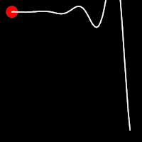

</td>
      <td>

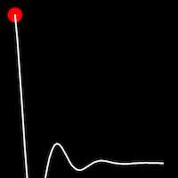
</td>
      <td>
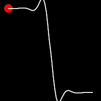

</td>
    </tr>
  </tbody>
</table>

 
 
 
 
 

## Bounce Easing

Bounce easing mimics the behavior of a bouncing ball, introducing a series of bounces as the motion progresses.
This method adds a dynamic animation, resembling the way objects bounce in the real world.

### [.inBounce()](./methods/inBounce.md)

It starts slowly and progressively speeds up,

### [.outBounce()](./methods/outBounce.md)

It starts slowly and progressively speeds up,

### [.inOutBounce()](./methods/inOutBounce.md)

It starts slow, accelerates until reaching full-speed at the midpoint, then and progressively slows down.

<table>
  <thead>
    <tr>
      <th>.inBounce()</th>
      <th>.outBounce()</th>
      <th>.inOutBounce()</th>
    </tr>
  </thead>
  <tbody>
  <tr>
      <td colspan="3">Bounce Easing</td>
   </tr>
    <tr>
      <td>
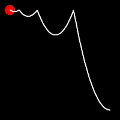

</td>
      <td>

</td>
      <td>

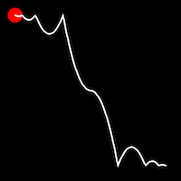
</td>
    </tr>
  </tbody>
</table>

 
 
 
 
 
