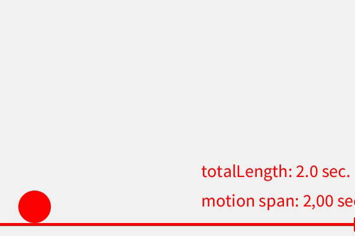

# .setSpan()


### Description 

This function is used to pass a value for the   ```span``` variable of an EasyEase Object.

It receives a float value which should be positive and may be greater or equal than 0.0;


 
### Examples

```java
import easy.ease.*;

EasyEase curve = new EasyEase(this, 5);
void setup() {
  size(600, 400);
  textSize(30);
  curve.setTotalLength(2.0);
}

void draw() {
  background(#f1f1f1);
  stroke(#ff0000);
  fill(#ff0000);
  strokeWeight(5);

  float span = map(width-mouseX, 0, width, 0, 2);

  curve.setSpan(span);

  float ptCurve_X = curve.linear(frameCount/60.0, 50, width-50) ;
  float ptCurve_Y = height - curve.inOut(frameCount/60.0, 50, height-50) ;
  ellipse(ptCurve_X, ptCurve_Y, 50, 50 );

  text ("totalLength: "+curve.getTotalLength()+" sec.", 340, 300);
  text ("motion span: "+String.format("%.2f", span)+" sec.", 340, 350);

  line(0, 380, width, 380);
  line(width-mouseX, 380-10, width-mouseX, 380+10);
  rec(30,900);
}


```


<div class="exampleWindow">
  <div class="title">
      <div class="dot red"></div>
      <div class="dot amber"></div>
      <div class="dot green"></div>
      <p >setSpan.pde</p>
  </div>



</div>


### Syntax

```myCurve.setSpan(span) ```

### Parameters

**```span```** (float)  the motion span expressed in seconds


### Return

**void**


### Related

- [3rd Constructor](constructors.md#constructor-3-with-exponential-intensity-and-time-related-parameters)

- [.setTotalLenght()](./tools/setTotalLength.md)

- [.setDelay()](./tools/setDelay.md)

