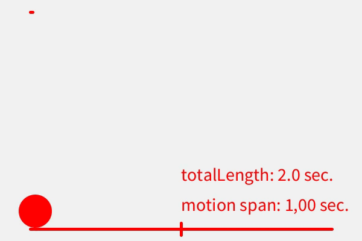
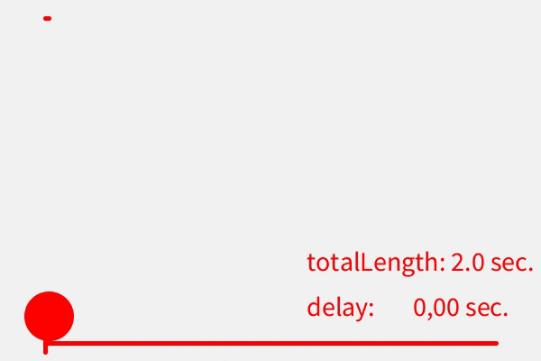
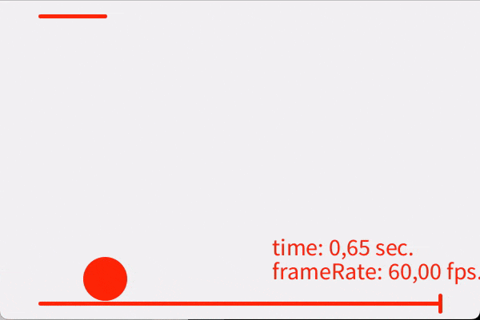

# Global Parameters

here is a list of all global parameters of an EasyEase object:

## **`intensity`**

The `intensity` variable determines the curve-bending factor of [Exponential](./methods.md#exponential-easing), [Back](./methods.md#back-easing) and [Circular](./methods.md#circular-easing) easing methods.

By default it is set to 1.0.

Custom values can be can be assigned

- statically, during object initialization using the [constructor #2 or #3](./constructors.md#constructor-2-with-exponential-intensity) or

- dynamically using the [.setIntensity](./tools/setIntensity.md) method

!!! tip

    The input parameter can be any float value; ideal inputs might be between >1 and 20sh.. to obtain a reasonable output;

    it applies: the higher the value, the sharper the curve

    - passing `0.0` will return `0.5` (in a range from `0` to `1`) for [Exponential easing](./methods.md#exponential-easing) and [Circular easing](./methods.md#circular-easing),
    or a gently shaped curve with no Back-bending for [Back easing](./methods.md#back-easing)

    - passing `1.0` will return a flat curve (in a range from 0 to 1)for [Exponential easing](./methods.md#exponential-easing) and [Circular easing](./methods.md#circular-easing),
    or a curve with a light Back-bending for [Back easing](./methods.md#back-easing)

    - passing a negative value (`< 0`) might return unexpected although interesting outputs

<div class="exampleWindow">
  <div class="title">
      <div class="dot red"></div>
      <div class="dot amber"></div>
      <div class="dot green"></div>
      <p >setIntensity.pde</p>
  </div>


</div>

<br>

---

## **`totalLength`**

The `totalLength` variable determines the lenght of the easing curve, in other words: how many seconds should a motion cycle last.

By default it is set to 1.0 second.

Custom values can be can be assigned

- statically, during object initialization using the [constructor #3](./constructors.md#constructor-2-with-exponential-intensity) or

- dynamically using the [.setTotalLength](./tools/setTotalLength.md) method

<div class="exampleWindow">
  <div class="title">
      <div class="dot red"></div>
      <div class="dot amber"></div>
      <div class="dot green"></div>
      <p >setTotalLength.pde</p>
  </div>


</div>

<br>

---

## **`span`**

The `span` variable determines the length of the curve bending time, in other words: how many seconds should a motion last.

By default it is set to 1 second, although it can be shortened and/or be combined with the [`delay`](#delay) parameter

Custom values can be can be assigned

- statically, during object initialization using the [constructor #3](./constructors.md#constructor-2-with-exponential-intensity) or

- dynamically using the [.setSpan](./tools/setSpan.md) method

!!! info

      assigning a value lower than or equal to 0 is not allowed; 
      it will return a ```WARNING``` message to the console and automatically set the ```span``` to the least allowed value which is ```totalLength / frameRate_```

      assigning a value higher than ```totalLength``` parameter is not allowed; it will return a ```WARNING``` message to the console and will automatically set the same value as for the ```totalLength```  

<div class="exampleWindow">
  <div class="title">
      <div class="dot red"></div>
      <div class="dot amber"></div>
      <div class="dot green"></div>
      <p >setSpan.pde</p>
  </div>



</div>

<br>

---

## **`delay`**

The `delay` variable determines the waiting time before the curve start bending, in other words: how many seconds before the motion starts

By default it is set to 0 second, so there is no delay although it can be customized and/or be combined with the [`span`](#span) parameter

Custom values can be can be passed

- statically, during object initialization using the [constructor #3](./constructors.md#constructor-2-with-exponential-intensity) or

- dynamically using the [.setDelay](./tools/setDelay.md) method

!!! info

      assigning a value higher than ```totalLength``` parameter is not allowed and will return a ```ERROR``` message to the console

<div class="exampleWindow">
  <div class="title">
      <div class="dot red"></div>
      <div class="dot amber"></div>
      <div class="dot green"></div>
      <p >setDelay.pde</p>
  </div>



</div>

<br>

---

## **frameRate\_**

The **`frameRate_`** variable specifies the amount of frames per second a motion cycle should be divided to.  
By default it is set at 60 fps like the default sketch's framerate

Custom values can be can be assigned

- statically, during object initialization using the [constructor #3](./constructors.md#constructor-2-with-exponential-intensity) or

- dynamically using the [.seFrameRate](./tools/setFrameRate.md) method

!!! info

    When setting a custom `frameRate_` for the EasyEase object, please ensure to set the sketch's `frameRate` accordingly, in order to avoid synchronization errors.

<div class="exampleWindow">
  <div class="title">
      <div class="dot red"></div>
      <div class="dot amber"></div>
      <div class="dot green"></div>
      <p >setFrameRate.pde</p>
  </div>


the gif  above runs @20fps and is only for demonstration purpose

</div>

<br>

---
