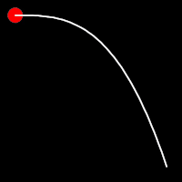
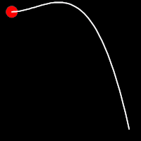
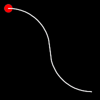

# Overview Table

**OF ALL AVAILABLE [EASING METHODS]()**

The library offers flexible functional methods for each of the following kind of easing curves:

- Exponential
- Sinusoidal
- Circular
- Back
- Bounce
- Elastic

    <table >
        <thead>
            <tr>
                <th colspan="1">ease-in</th>
                <th colspan="1">ease-out</th>
                <th colspan="1">ease-in-out</th>
            </tr>
        </thead>
         <tbody>
            <tr>
                <td colspan="3"><h3>Exponential</h3></td>
            </tr>
            <tr>
                <td>
                    

                        
                    

                    

                        
                    

                </td>
                <td>
                    

                        
                    

                    

                        
                    

                </td>
                <td>
                    

                        
                    

                    

                        
                    

                </td>
            </tr>

            <tr>
                <td colspan="3"><h3>Back</h3></td>
            </tr>
            <tr>
                <td>
                    

                        
                    

                    

                        
                    

                </td>
                <td>
                    

                        
                    

                    

                        
                    

                </td>
                <td>
                    

                        
                    

                    

                        
                    

                </td>
            </tr>

            <tr>
                <td colspan="3"><h3>Circular</h3></td>
            </tr>
            <tr>
                <td>
                    

                        
                    

                    

                        
                    

                </td>
                <td>
                    

                        
                    

                    

                        
                    

                </td>
                <td>
                    

                        
                    

                    

                        
                    

                </td>
            </tr>

            <tr>
                <td colspan="3"><h3>Sinusoidal</h3></td>
            </tr>
            <tr>
                <td>
                    

                        
                    

                    

                        
                    

                </td>
                <td>
                    

                        
                    

                    

                        
                    

                </td>
                <td>
                    

                        
                    

                    

                        
                    

                </td>
            </tr>

            <tr>
                <td colspan="3"><h3>Elastic</h3></td>
            </tr>
            <tr>
                <td>
                    

                        
                    

                    

                        
                    

                </td>
                <td>
                    

                        
                    

                    

                        
                    

                </td>
                <td>
                    

                        
                    

                    

                        
                    

                </td>
            </tr>

            <tr>
                <td colspan="3"><h3>Bounce</h3></td>
            </tr>
            <tr>
                <td>
                    

                        
                    

                    

                        
                    

                </td>
                <td>
                    

                        
                    

                    

                        
                    

                </td>
                <td>
                    

                        
                    

                    

                        
                    

                </td>
            </tr>

        </tbody>
       

    </table>
 

